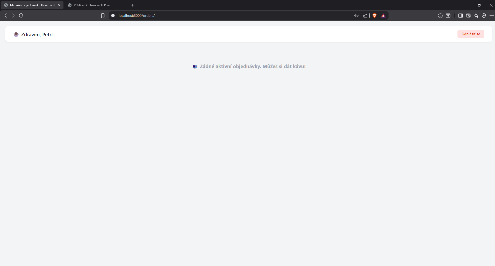
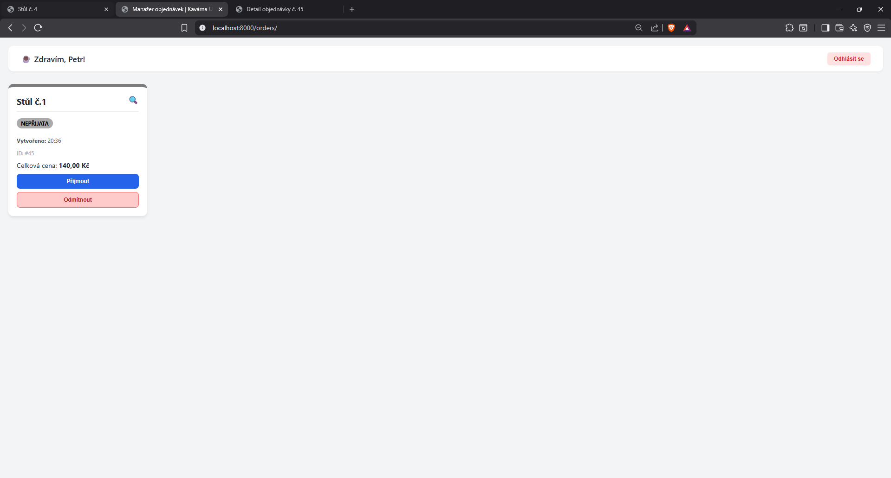
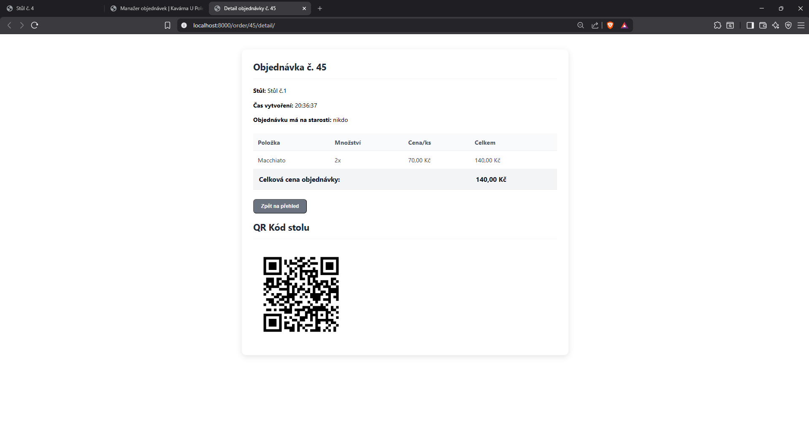
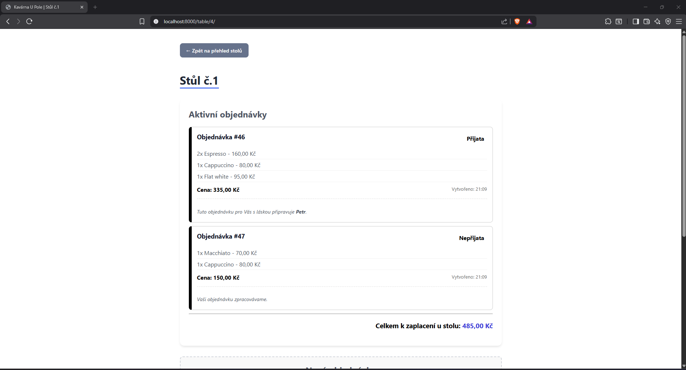
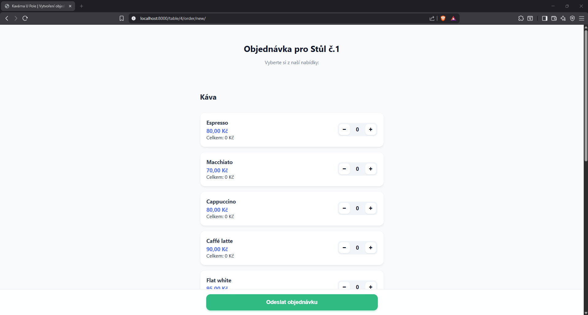

# ☕ Kavárna U Pole – Dokumentace k projektu

## 📋 Obsah ZIP souboru
- `/config` - Konfigurační soubory Django
- `/OrderSystem` - Hlavní aplikace s logikou a testy.
- `/bin` - Podpůrné skripty k usnadnění práce
- `/static` - CSS
- `/images` - Obrázky použité v README
- `/templates` - HTML šablony (včetně QR kódů).
- `Dockerfile` & `docker-compose.yml` - Konfigurace pro snadné spuštění.
- `db.sqlite3` - Předpřipravená databáze se základními daty.
- `requirements.txt` - Seznam potřebných knihoven.
- `manage.py` - Skript pro správu projektu (spouštění serveru, migrace databáze, vytváření adminů a spouštění testů).


## 🛠 Instalace a spuštění
1. Rozbalte ZIP archiv a otevřete terminál ve složce práce.
2. Spusťte příkaz: 
```bash
docker-compose up --build
```
3. Aplikace je dostupná na adrese `http://localhost:8000`


❗ DŮLEŽITÉ: K fungování QR kódů v mobilu je potřeba místo localhost zadat do prohlížeče v PC IP adresu Vašeho počítače v lokální síti (např. http://192.168.1.15:8000). Mobil i PC musí být ve stejné síti.

💡 TIP: Pro usnadnění práce využijte připravené skripty ve složce /bin. Stačí spustit bin/start_container_windows.bat nebo bin/start_container_linux.sh, které by měli automaticky sestavit prostředí, provést migrace a otevřít prohlížeč.

## 👤 Administrátorský přístup
Pro přístup do administrace Django použijte tyto údaje:

* **URL administrace:** `http://localhost:8000/admin`  (nebo přes hlavní rozcestník)
* **Uživatelské jméno:** `root`
* **Heslo:** `1234`

Přidávání zaměstanců, stolů a položek v menu probíhá zde.

## 👨‍🍳 Přístup pro personál
Zaměstnanci mají přístup k hlavnímu dashboardu, kde přijímají a odbavují objednávky.

* **URL dashboardu:** `http://localhost:8000/orders/` (nebo přes hlavní rozcestník)
* **Předvytvořené účty:** `emp1`, `emp2`
* **Heslo pro oba:** `hesloheslo`
> 🔐 **Poznámka k zabezpečení:** Přístup k dashboardu a k funkcím pro správu objednávek je chráněn. Pokud se pokusíte na tyto stránky vstoupit bez přihlášení, systém vás automaticky přesměruje na přihlašovací stránku 

### Ukázka zaměstnaneckého systému bez objednávky


### Ukázka zaměstnaneckého systému s objednávkou


### Zobrazení souhrnu objednávky
K zobrazení souhrnu je potřeba zmáčkout lupu na kartě objednávky


### Ukázka souhrnu objednávky


## 🪑 Přístup pro zákazníky (Stoly)
Hosté přistupují k menu a svým objednávkám skrze rozhraní jednotlivých stolů.

* **Hlavní rozcestník:** `http://localhost:8000/` (seznam všech stolů)
* **Stránka konkrétního stolu:** `http://localhost:8000/table/<ID_STOLU>/`

### Jak probíhá objednávka:
1. **Naskenování QR kódu nebo Zmáčknutí tlačítka** Host naskenuje kód umístěný na stole (generuje se dynamicky na stránce stolu) nebo tlačítko s textem "Otevřít lístek"
2. **Vybrání položek a odeslání objednávky** Host si pomocí ui nakliká co chce a poté klikne na "Odeslat objednávku"

### Ukázka zákaznického rozhraní:


### Ukázka tvoření objednávky:



## 🧪 Automatizované testy
1. Otevřete si terminál v kořenovém adresáři projektu **práce**
2. Testy lze spustit příkazem :
```bash
    docker-compose exec web python manage.py test
```
💡 TIP: Opět můžete použít předpřipravené skripty pro spuštění testů bin/run_tests_windows.bat a bin/run_tests_linux.sh

## Vytvořil Petr Zemánek